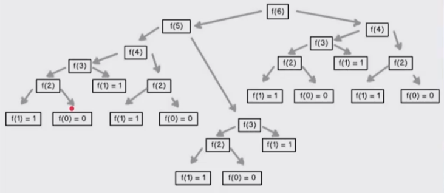

# Estadística Computacional con Python

## Introducción

Esto es el resultado del curso impartido por [David Aroesti](https://github.com/jdaroesti) en [Platzi](https://platzi.com).

# Tabla de Contenidos

1. [Programación Dinámica](#Programación-Dinámica)
2. [Caminos Aleatorios](#Caminos-Aleatorios)

# Programación Dinámica

## Introducción a la programación Dinámica

---

Sabiendo que la Programación Dinámica no está relacionada con su nombre, lo cierto es que sí es una de las técnicas mas poderosas para poder optimizar cierto tipos de problemas.

Los problemas que puede optimizar son aquellos que tienen una subestructura óptima, esto significa que una solución óptima global se puede encontrar al combinar soluciones óptimas de subproblemas locales.

También nos podemos encontrar con los problemas empalmados, los cuales implican resolver el mismo problema en varias ocasiones para dar con una solución óptima.

## Optimización de Fibonacci

---

# Caminos Aleatorios

Los **caminos aleatorios** es un tipo de simulación en el que se elige de forma aleatoria, una decisión dentro del conjunto de decisiones 'válidas'. Se utiliza en **campos no deterministas** donde se usan elementos de aleatoriedad.

### Camino de Borrachos

---

Es una simulación, donde empezamos en un punto 0, y debemos tomar la decisión aleatoria de movernos hacia una opción establecida.

